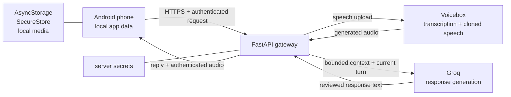

<p align="center">
  
</p>

<h1 align="center">Saanjh</h1>

<p align="center"><strong>A familiar voice. A safer promise.</strong></p>

<p align="center">
  A consent-first AI voice companion for grounding, reflection, and feeling less alone—without pretending to be or replace a real person.
</p>

<p align="center">
  <a href="https://youtu.be/WlnimyM8QmA?si=UtG9H33SnZdt1iEF"><strong>Watch the demo</strong></a>
  ·
  <a href="showcase/README.md">Run the immersive presentation</a>
  ·
  <a href="docs/ARCHITECTURE.md">Architecture</a>
  ·
  <a href="SECURITY.md">Security</a>
</p>


## What Saanjh is

Saanjh is an Expo Android app backed by a small FastAPI gateway. A user can create a companion from their own input, establish the voice-owner and consent context, record or import a real sample, and have turn-based text or voice conversations.

A voice turn follows a real pipeline:

```text
recorded speech → Voicebox transcription → Groq response → Voicebox synthesis → local playback
```

The app begins empty. It does not seed a companion, memories, chats, moods, journals, or fallback replies. Personal records shown by the Android app come from the user or from a live service response.

### Product boundaries

- **Consent before cloning.** Self voice, a living person with explicit consent, and memorial use are treated as different cases.
- **Clearly AI-generated.** Saanjh never claims that the companion literally is the sampled person.
- **Companion, not clinician.** It does not diagnose, replace professional care, or act as an emergency service.
- **Care without dependency.** There are no streaks, guilt loops, fabricated memories, or prompts that discourage real human connection.
- **Local-first Android data.** Companion settings, messages, moods, journals, session history, and downloaded audio stay on the phone.

## What works

- Six-step consent-first companion setup.
- Real microphone recording and audio import.
- A six-second minimum sample check before cloning.
- Voicebox profile creation, sample attachment, transcription, synthesis, polling, cancellation, and authenticated audio download.
- Groq chat with user-approved companion style and bounded local history.
- Visible voice-turn stages: listening, transcribing, thinking, preparing the voice, downloading, and playback.
- Text sessions, voice sessions, before/after mood check-ins, journaling, aftercare, and distress routing.
- Full-screen forest rituals with gesture-based mechanics, sound, haptics, progress, and reduced-motion support.
- Duplicate-safe Voicebox profile names and remote-first cloned-profile deletion.
- Responsive Vite web prototype and a separate cinematic Three.js presentation.

## Repository map

```text
saanjh/
├── App.tsx                 # Expo / React Native application
├── src/                    # Native components, storage, API client, theme
├── assets/                 # Original artwork, ritual scenes, and WAV cues
├── backend/                # FastAPI gateway, schemas, tests, Docker setup
├── web/                    # Responsive React + Vite prototype
├── showcase/               # Standalone 3D scroll presentation
├── deploy/                 # Private prototype hosting helpers
├── docs/                   # Architecture, safety, setup, troubleshooting
└── .github/workflows/      # Reproducible CI checks
```

## Architecture



The Android client uses `POST /api/v1/local/chat`, which does not persist the turn in the backend database. Groq necessarily processes the current prompt and bounded history. Voicebox necessarily retains the consented cloned profile and sample required for synthesis. See [the detailed architecture](docs/ARCHITECTURE.md) and [privacy and safety boundaries](docs/PRIVACY_AND_SAFETY.md).

## Prerequisites

- Node.js 22 or newer.
- Python 3.11 or newer.
- Android Studio or an Expo-compatible Android device for native development.
- A Groq API key.
- [Voicebox](https://github.com/jamiepine/voicebox) running locally; Saanjh defaults to `http://127.0.0.1:17493`.

Voice synthesis is GPU-heavy. The first response may be slower while Voicebox loads its model.

## Quick start

### 1. Install JavaScript dependencies

From the repository root:

```powershell
npm ci
npm --prefix web ci
npm --prefix showcase ci
```

### 2. Configure the backend

Windows PowerShell:

```powershell
cd backend
python -m venv .venv
.\.venv\Scripts\Activate.ps1
python -m pip install -r requirements.txt
Copy-Item .env.example .env
```

macOS or Linux:

```bash
cd backend
python3 -m venv .venv
source .venv/bin/activate
python -m pip install -r requirements.txt
cp .env.example .env
```

Set at least these values in `backend/.env`:

```dotenv
GROQ_API_KEY=your_groq_key_here
VOICEBOX_URL=http://127.0.0.1:17493
```

For any endpoint reachable beyond the local computer, also set a random value of at least 32 characters:

```dotenv
SAANJH_API_TOKEN=replace_with_a_long_random_value
```

Never commit either `.env` file.

### 3. Start Voicebox and FastAPI

Start Voicebox and verify its local server is online at port `17493`. Then, from `backend`:

```powershell
python -m uvicorn app.main:app --reload --host 127.0.0.1 --port 8000
```

Useful local checks:

- Process liveness: `http://127.0.0.1:8000/livez`
- Authenticated service health: `http://127.0.0.1:8000/api/health`
- OpenAPI UI: `http://127.0.0.1:8000/docs`

### 4. Run a client

Expo Android:

```powershell
npm run expo:start
```

Responsive web prototype:

```powershell
npm run dev
```

Immersive presentation:

```powershell
npm run showcase
```

## Android connection configuration

Copy the public app example and keep the real values only in your ignored local file:

```powershell
Copy-Item .env.example .env
```

```dotenv
EXPO_PUBLIC_API_URL=https://your-fastapi-host.example
EXPO_PUBLIC_EAS_PROJECT_ID=your-eas-project-id
```

The server URL is not a secret. Groq and Voicebox credentials always remain in `backend/.env`.

For a private hackathon build, `SAANJH_API_ACCESS_TOKEN` can bootstrap the matching gateway token automatically. That value is compiled into the APK and can be extracted, so keep it out of Git and never use this shared-token pattern for a public release. A public release needs per-device enrolment and short-lived, revocable credentials.

The app can also save a server address and private connection key at runtime using SecureStore. See [anywhere-network deployment](deploy/ANYWHERE_NETWORK.md) for the private prototype topology.

## Build and verify

Run all source checks:

```powershell
npm run check
```

Or run them independently:

```powershell
npm run typecheck:expo
npm run build
npm run showcase:build
npm run test:backend
```

EAS Android builds:

```powershell
npm run android:build:preview
npm run android:build:production
```

- `preview` produces an installable private-testing APK.
- `production` produces an Android App Bundle for store distribution.
- The Android application ID is `com.saanjh.companion`.

Set `EXPO_PUBLIC_API_URL`, `EXPO_PUBLIC_EAS_PROJECT_ID`, and any private-demo bootstrap credential as local or EAS environment values before building. The repository deliberately contains no live hostname or bearer token.

## Deployment choices

The fastest prototype topology is a private Windows PC running FastAPI and Voicebox behind an HTTPS tunnel. It works only while that PC is powered on, awake, connected, signed in, and running Voicebox.

An always-on deployment requires a compatible GPU host, TLS, real user/device authentication, rate limits, encrypted voice-profile storage, monitoring, and a documented deletion policy. Do not publish Voicebox port `17493` directly.

## Troubleshooting

Start with [docs/TROUBLESHOOTING.md](docs/TROUBLESHOOTING.md). The most useful rule is to read the structured FastAPI error line before changing ports or rebuilding the app: a green Voicebox health result only proves the service is reachable, not that a particular profile or sample is valid.

## Contributing and security

Read [CONTRIBUTING.md](CONTRIBUTING.md) before opening a change. Voice cloning, consent, identity claims, crisis handling, authentication, or data retention changes require an explicit safety review.

Do not report security or consent vulnerabilities in a public issue; follow [SECURITY.md](SECURITY.md).

## Prototype status

Saanjh is a wellness and product prototype, not a medical device, clinician, emergency service, or proof of clinical efficacy. No usage metrics, outcomes, or testimonials are claimed by this repository.

No open-source license has been selected for Saanjh yet. Until a `LICENSE` file is added, the source is available for review but is not automatically granted for reuse or redistribution.
