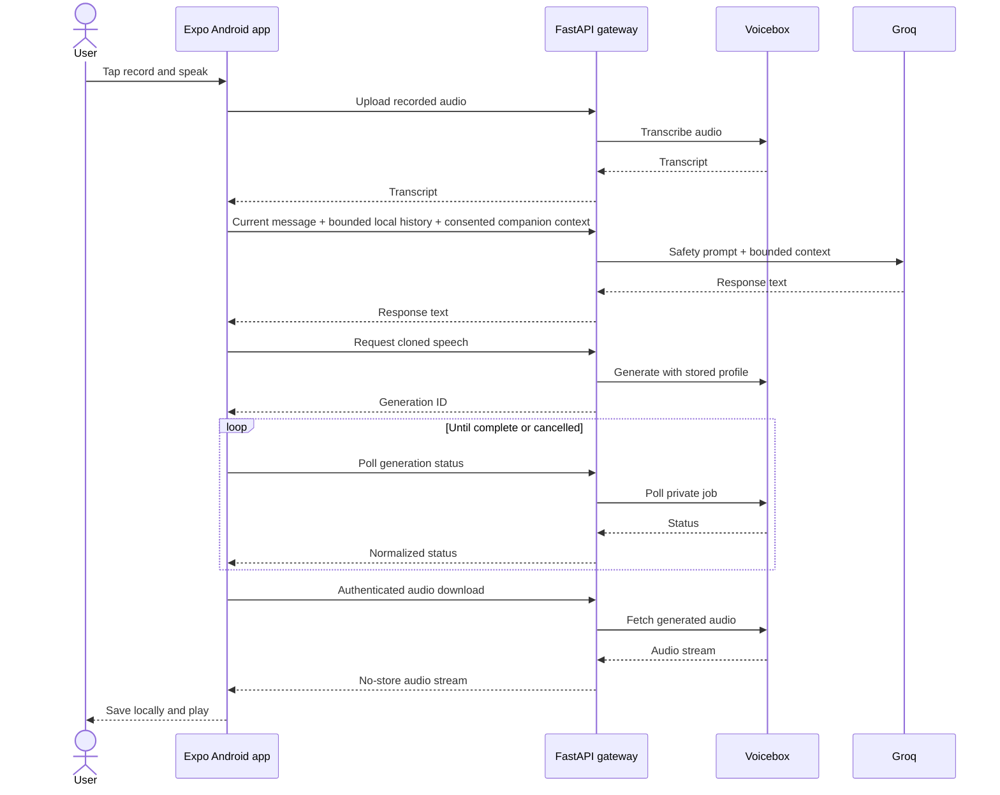

# Saanjh architecture

Saanjh has three user-facing surfaces and one service boundary:

- The Expo Android app is the primary local-first experience.
- `web/` is a responsive database-backed prototype.
- `showcase/` is a static presentation and makes no backend request.
- `backend/` is the only component that talks to Groq or Voicebox.

## Android voice turn

The app shows progress for the network and generation stages and exposes cancellation while a turn is still pending.

## Data ownership

| Data | Android location | Sent for processing | Backend persistence in local-first mode |
| --- | --- | --- | --- |
| Companion configuration | AsyncStorage | Selected fields needed for the current chat turn | No |
| Messages and session history | AsyncStorage | Bounded recent history for a requested Groq turn | No |
| Moods and journal entries | AsyncStorage | No | No |
| Connection setting | SecureStore | Used to authenticate requests | No |
| Selected/recorded media | App-private files | Voice sample or current speech when explicitly requested | No gateway database write |
| Downloaded generated audio | App-private files | No | No |
| Cloned profile and sample | Voicebox storage | Required for synthesis | Retained by Voicebox until deletion |

The older web routes for companions, sessions, messages, moods, and journals use SQLite. The Android local-first route is `POST /api/v1/local/chat` and does not use those tables.

## Gateway responsibilities

FastAPI:

- holds the Groq key and private Voicebox URL;
- validates consent and request shapes;
- applies the companion and wellness system prompt;
- bounds message history and upload sizes;
- normalizes Voicebox response variants;
- returns stable error envelopes;
- prevents Voicebox personality rewriting of the reviewed response;
- streams generated audio with `Cache-Control: no-store`;
- handles duplicate-safe profile naming and remote-first deletion.

## Deployment boundary

For the current private prototype, FastAPI and Voicebox may run on the same GPU-capable PC. Only FastAPI should be exposed through HTTPS; Voicebox remains on loopback. Public distribution requires per-user or per-device authentication instead of a shared bearer token.

## Technology map

- Expo SDK 57, React Native 0.86, React 19, TypeScript.
- Expo Audio, FileSystem, Document Picker, SecureStore, Haptics, Linear Gradient, Blur, and Splash Screen.
- AsyncStorage and app-private media for Android-local records.
- FastAPI, Pydantic, HTTPX, and optional SQLite-backed web routes.
- Groq for response generation.
- open-source Voicebox for transcription and cloned speech.
- Vite + React for the responsive web prototype.
- Vite + Three.js for the static immersive presentation.
